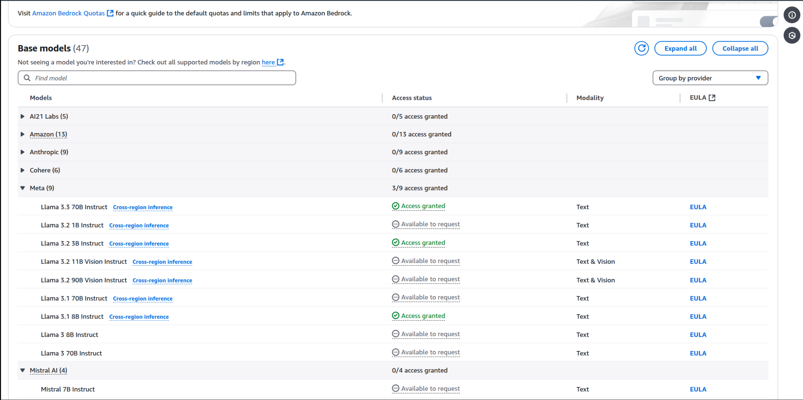

# amazon-bedrock

A simple repository to show how you can leverage models from Amazon Bedrock in a few steps.

Notice that this tutorial is bit more complex than the examples provided
in [AWS documentation](https://boto3.amazonaws.com/v1/documentation/api/latest/reference/services/bedrock/client/get_foundation_model.html#).
This is due to the fact that we obtain the credentials dynamically by making a user assume a role that has access to
Bedrock.
If you don't need to do this in your application, simply refer to the AWS tutorial, which will be simpler!.

## Steps

You will need
an [AWS account](https://aws.amazon.com/free/?gclid=CjwKCAiAqfe8BhBwEiwAsne6gaHrp73-1Dy6J65sUikjRF0MK0wmEocaqS-NkXosHTHrXk5TxeCOMBoCN8cQAvD_BwE&trk=946a9192-9b37-44c7-8b34-dbfa59d5a000&sc_channel=ps&ef_id=CjwKCAiAqfe8BhBwEiwAsne6gaHrp73-1Dy6J65sUikjRF0MK0wmEocaqS-NkXosHTHrXk5TxeCOMBoCN8cQAvD_BwE:G:s&s_kwcid=AL!4422!3!455709741510!e!!g!!aws!10817378570!108173613722&all-free-tier.sort-by=item.additionalFields.SortRank&all-free-tier.sort-order=asc&awsf.Free%20Tier%20Types=*all&awsf.Free%20Tier%20Categories=*all)
for this to work.

1. Log into your AWS account.
2. Click onto your account and then go to "ServiceMaintainer"
3. Type "Amazon Bedrock" on the Search Bar.
4. Once you're in this screen, you can validate the Model Catalog and also enable any desired models we might want to
   try.

### Enable a new model

1. Access the Model Catalog.
   
2. Click on the family of models that you want to see. In this case, we will choose "Meta".
   
3. Click on the triple dots and then Modify access . You will be directed to the model access panel, so you can find any
   models that you want and enable access for them.
   
4. Click on "Available to request", then you will be taken to a page that shows you all of the models you currently have
   access to as well as the new one selected. Click on "Next" and finally on "Submit".
   
5. Enjoy your new model!.
   

### Setup user and role

1. Go to IAM, then create a new role. In our case, we called it `BedrockServices` (will have access to
   `AmazonBedrockFullAccess`).
   
2. Create a new user. This will be the service user that will assume the role previously created. Give it the
   possibility to assume the role previously created.
   You will do this by editing the policy and adding the following block of code:
   ```
   {
       "Version": "2012-10-17",
       "Statement": [
           {
               "Effect": "Allow",
               "Action": "sts:AssumeRole",
               "Resource": "arn:aws:iam::AWS_ACCOUNT_ID:role/BedrockServices"
           }
       ]
   }
   ```
3. Review and save the changes.
4. Now we use the `AWS_ACCESS_KEY_ID` and `AWS_SECRET_ACCESS_KEY` of the user that we created and try to assume the
   `BedrockServices` role with the code provided. With this information, we can always obtain a new session token
   and use it programmatically. Make sure to also complete the `AWS_ACCOUNT_ID` in the [env file](.env) for the example
   code to work.
5. 📣 One important detail: there are some models that support Cross Inference Regions, meaning that even though the
   model is not strictly deployed in the same region as your account is, you can still use it. For this to work, your
   account needs to have access to that region, otherwise you will get an `AccessDenied`.